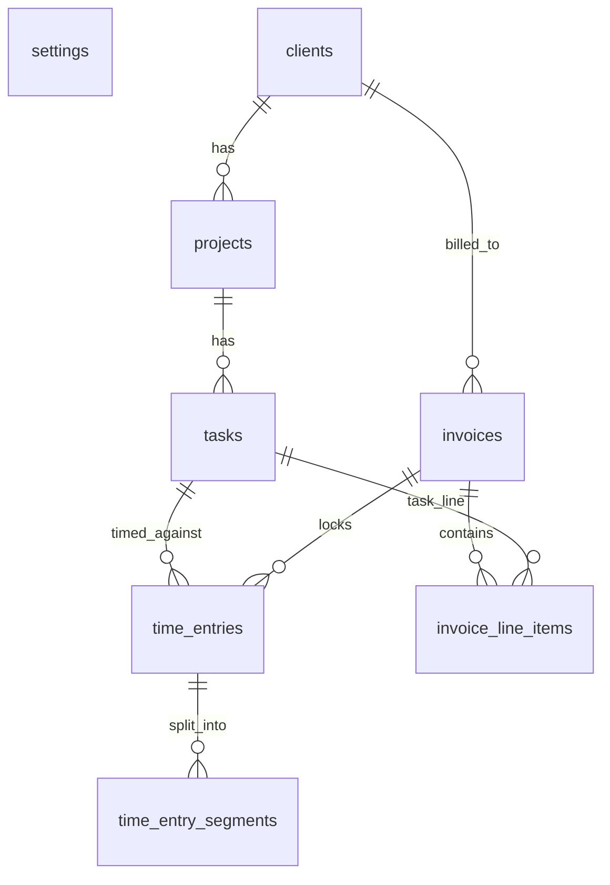

# Data Model

The SQLite schema, as built by the ordered migrations in `db/migrations/` and
applied at startup. This page summarizes the shipped tables; the business rules
behind them are in `.memory/domain-model.md`.

Conventions that apply everywhere:

- **IDs** are ULIDs (`TEXT` primary keys) — except `settings`, which is a singleton
  with `id INTEGER PRIMARY KEY CHECK (id = 1)`.
- **Money** columns are integer minor units (cents). Never floats.
- **Timestamps** are UTC ISO 8601 `TEXT`. `created_at` / `updated_at` on every
  mutable entity.
- SQL is snake_case; the query modules map to camelCase for TypeScript.
- `foreign_keys = ON`. FKs default to `NO ACTION` (RESTRICT-like) — the "block delete
  if children" rule — except where noted.

## Entity relationships

## Tables

### `settings` (singleton)

`id` (always 1), `sender_name`, `sender_address`, `sender_email`,
`sender_phone?`, `payment_instructions`, `currency_code`, `currency_decimals`,
`default_payment_terms_days`, `invoice_locale`. Seeded once by the first migration
with placeholders; edited at `/settings`. Exactly one row, always present.

### `clients` → `projects` → `tasks`

The setup hierarchy. Each carries `name`, a nullable `archived_at`, and timestamps.

- `projects.client_id → clients.id`, plus `projects.hourly_rate` (integer minor
  units — the rate every task under it inherits). Indexed on `client_id`.
- `tasks.project_id → projects.id`. Indexed on `project_id`.

### `time_entries` → `time_entry_segments`

- `time_entries`: `task_id → tasks.id`, `notes` (default `''`), `state`
  (CHECK-constrained to the six `entry.*` states), nullable `invoice_id → invoices.id`,
  nullable `edit_form_snapshot` (JSON, only while `entry.editing`). A CHECK enforces
  `invoice_id IS NOT NULL` **iff** `state = 'entry.locked'`. Indexed on `task_id`,
  `state`, `invoice_id`.
- `time_entry_segments`: `entry_id → time_entries.id`, `started_at`, nullable
  `stopped_at`. CHECK `stopped_at IS NULL OR stopped_at >= started_at`. A **partial
  unique index** allows at most one open segment (`stopped_at IS NULL`) per entry.

### `invoices` → `invoice_line_items`

- `invoices`: `client_id → clients.id`, `state` (four `invoice.*` states),
  `start_date` / `end_date` (local `YYYY-MM-DD`, inclusive), nullable **UNIQUE**
  `invoice_number` (`YYYYMMDD-N`, NULL until finalize), `payment_terms_days`, the
  snapshotted currency triple (`currency_code`, `currency_decimals`,
  `invoice_locale`), the money triple (`subtotal`, `discount_total`, `total`), and
  nullable `finalized_at` / `voided_at`. CHECK constraints enforce
  `total = subtotal + discount_total`, `discount_total <= 0`, `end_date >= start_date`,
  and state-dependent nullability (draft ⇒ no number / no `finalized_at`; voided ⇒
  `voided_at` set). Indexed on `client_id`, `state`.
- `invoice_line_items`: `invoice_id → invoices.id` **`ON DELETE CASCADE`** (so
  deleting a draft cleans up its lines), `kind` (`task` | `discount`), nullable
  `task_id → tasks.id`, `description`, nullable `hours` / `rate` (task lines only),
  `amount`, `sort_order`. A kind-specific CHECK enforces the field shape and sign
  (task: all present, `hours > 0`, `amount > 0`; discount: no task/hours/rate,
  `amount < 0`). A **partial unique index** allows at most one discount line per
  invoice.

## Why the FKs and CHECKs matter

The schema, not just the application code, refuses to hold an impossible state: a
locked entry with no invoice, a finalized invoice with no number, two discount lines,
a positive discount, or two open segments on one entry. The state machines in
[State machines](/architecture/state-machines) enforce the _transitions_; these
constraints are the backstop.
