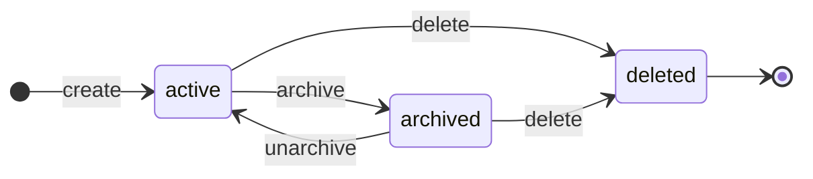

# State Machines

Three linked lifecycles drive the whole app: **Client / Project / Task setup**,
**Time Entry (timer)**, and **Invoice**. They live in `src/lib/state/*.ts`. This
page summarizes them; the authoritative tables, every rejection reason, and the
transition-log schema are in `.memory/state-transitions.md`.

Each state machine follows the same shape: a function runs its **preconditions**,
applies the **DB write**, and emits exactly **one transition-log line** — accepted,
or rejected with a canonical `rejectionReason`. A `StateTransitionError` carries that
reason up to the route, which returns it as a `400`.

## Diagram

```mermaid
stateDiagram-v2
    direction LR

    state "Time Entry" as TE {
        [*] --> entry_draft: pick task
        entry_draft --> entry_running: Start
        entry_draft --> entry_discarded: Discard
        entry_running --> entry_stopped: Stop
        entry_stopped --> entry_editing: Edit
        entry_editing --> entry_stopped: Save / Cancel
        entry_stopped --> entry_running: Resume (new segment)
        entry_stopped --> entry_discarded: Delete
        entry_stopped --> entry_locked: invoice finalized
        entry_locked --> entry_discarded: invoice voided
        entry_locked --> [*]
        entry_discarded --> [*]
    }

    state "Invoice" as INV {
        [*] --> invoice_draft: generate
        invoice_draft --> invoice_draft: edit
        invoice_draft --> invoice_finalized: Finalize
        invoice_finalized --> invoice_exported: Export PDF
        invoice_exported --> invoice_exported: Re-export
        invoice_finalized --> invoice_voided: Void
        invoice_exported --> invoice_voided: Void
        invoice_voided --> [*]
    }

    invoice_finalized -.locks.-> entry_locked
    invoice_voided -.discards.-> entry_discarded
```

The two dotted edges are the **system cascades**: finalizing an invoice locks every
source entry, and voiding one discards them — each cascade shares the triggering
user action's `correlationId`.

## 1. Client / Project / Task (`state/{client,project,task}.ts`)

A simple `active ⇄ archived` lifecycle per entity, with hard-delete as a
log-only pseudo-terminal state.



Key rules:

- **Archive does not cascade.** Archiving a client with any `active` project (or a
  project with any `active` task) is rejected — `children_not_archived`. Archive
  bottom-up.
- Creating a child under an archived parent → `parent_archived`.
- Archiving a task with a running timer → `task_has_running_timer`.
- Hard-deleting anything referenced by a non-draft invoice → `referenced_by_invoice`.

## 2. Time Entry (`state/entry.ts`)

The core loop. An entry owns one or more **segments** (`time_entry_segments`); total
duration is the sum. While `entry.running`, exactly one segment is open
(`stopped_at IS NULL`). `entry.draft` and `entry.editing` are **persisted** rows, so
a half-composed entry or an open edit form survives a reload.

Operations: `pickTask`, `startTimer`, `stopTimer`, `openEdit`, `saveEdit`,
`cancelEdit`, `resumeEntry`, `updateSegment`, `discardEntry`, plus the
system-triggered `lockEntry` / `unlockToDiscarded` called by the invoice machine.

Rejections: `concurrent_timer_forbidden` (only one running entry app-wide),
`entry_locked_by_invoice`, `invalid_time_range` (`stopped_at < started_at`),
`segment_overlap`, `task_archived`, `cannot_edit_running_entry` (stop before edit).

There is **no midnight auto-stop** — a segment can span days; calendar views split
the _rendering_ by day, never the underlying segment.

## 3. Invoice (`state/invoice.ts`)

`draft → finalized → exported`, with `voided` as the terminal reversal. An invoice
covers **one client + one inclusive `[startDate, endDate]`** in local time; lines are
grouped by task with the project rate snapshotted at generation.

Operations: `generateDraftInvoice`, `addDiscountLine`, `removeDiscountLine`,
`finalizeInvoice` (assigns `YYYYMMDD-N`, cascades entries → `entry.locked`),
`exportInvoice`, `voidInvoice` (cascades entries → `entry.discarded`), `deleteDraft`.

Rejections: `no_billable_entries`, `invoice_locked`, `invoice_non_positive_total`,
`invalid_discount_line` (>1 discount line or a non-negative one),
`must_finalize_before_export`, `void_requires_finalized`.

## Reading the log

Every transition — accepted or rejected — is one line in `logs/transitions.jsonl`.
To trace a flow, grep by `correlationId`; to audit rejections, filter
`accepted:false` and read `rejectionReason`. The canonical field list and examples
(including the finalize cascade) are in `.memory/state-transitions.md` §Structured
Transition Log.
